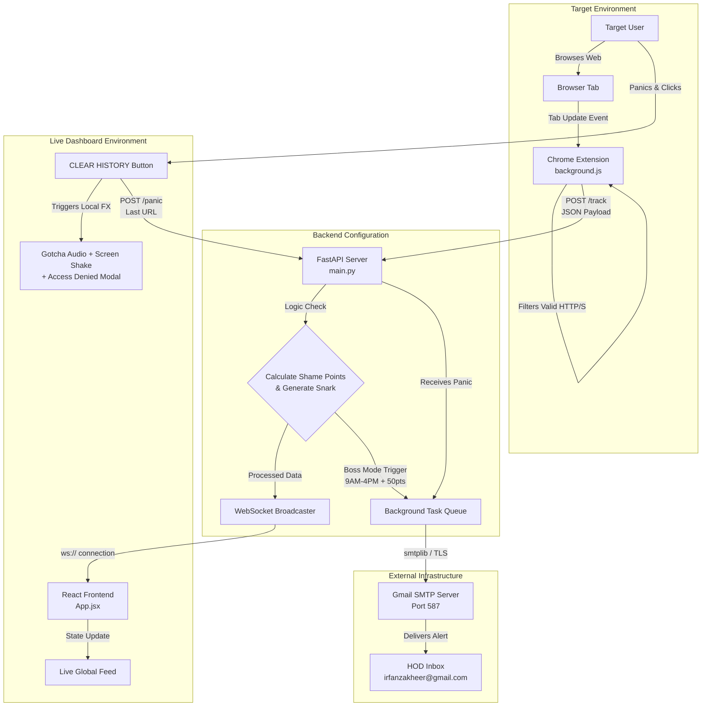

# Outcognito Mode 🎯

## Basic Details
### Team Name: Team Nexus

### Team Members
- Team Lead: Irfan Zakhir - Mar Baselios Christian College of Engineering and Technology
- Member 2:  Nasif Shaji -  Mar Baselios Christian College of Engineering and Technology


### Project Description
Outcognito is a highly intrusive, sarcastic browser extension and real-time dashboard that monitors your web traffic, publicly broadcasts your procrastination, and relentlessly bullies you for not focusing on your assignments. 

### The Problem (that doesn't exist)
Students secretly procrastinate on Reddit and Netflix while pretending to do their S5 coursework, feeling zero public shame for their actions. 

### The Solution (that nobody asked for)
A browser extension that snitches on every URL you visit, broadcasting it to a live React dashboard with sarcastic AI judgments based on the site. If you try to hide your tracks by clicking the tempting "Clear History" button, the screen violently shakes, blasts a "Gotcha!" audio clip, doubles your shame score, and silently emails your exact browsing history straight to the HOD.

## Technical Details
### Technologies/Components Used
For Software:
- **Languages:** Python, JavaScript, HTML, CSS
- **Frameworks:** FastAPI, React, Vite, Tailwind CSS
- **Libraries:** WebSockets, `smtplib` (Python built-in), Chrome Extension API (Manifest V3)
- **Tools:** Node.js, VS Code, Google App Passwords

For Hardware:
- N/A


### Implementation
For Software:
# Installation
```bash
# Clone the repository
git clone [\[https://github.com/YOUR_GITHUB_USERNAME/outcognito-mode.git\](https://github.com/YOUR_GITHUB_USERNAME/outcognito-mode.git)](https://github.com/irfanzakhir/outcognito-mode.git)

# Setup Backend Environment
cd backend
python -m venv venv
venv\Scripts\activate
pip install fastapi uvicorn websockets

# Setup Frontend Environment
cd ../frontend
npm install
```

Run
```bash
Bash
# Terminal 1: Run the Backend
cd backend
venv\Scripts\activate
uvicorn main:app --reload

# Terminal 2: Run the Frontend
cd frontend
npm run dev
```

To run the Extension:

Open chrome://extensions/ or edge://extensions/

Enable "Developer mode"

Click "Load unpacked" and select the extension folder.

Project Documentation
For Software:

Screenshots (Add at least 3)
[


Diagrams
# Diagrams



Project Demo
Video
[Add your demo video link here]
A live demonstration of the extension catching procrastination, updating the React dashboard, and the HOD email being triggered by the fake panic button.

Additional Demos
[Add any extra demo materials/links]

Team Contributions
Irfan Zakhir: Built the FastAPI WebSocket server, Manifest V3 Chrome Extension, React/Tailwind frontend, and SMTP HOD email integration.

[Name 2]: [Specific contributions]

[Name 3]: [Specific contributions]

Made with ❤️ at TinkerHub Useless Projects
